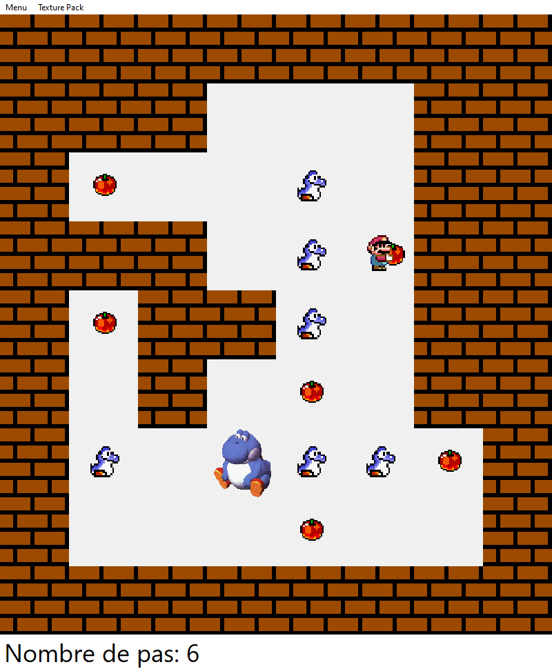

# Sokoban



Ce jeu a été créé par:
* Allan Ponchaut
* Antoine Leva
* Lucas Girod-Roux 
* Sullyvan Buyse

# Prérequis

* Python
* PyQt5

# Comment lancer le jeu

Naviguez dans votre répertoire Sokoban depuis le terminal et tapez:

```cmd
python sokobanMain.py
```

Vous pouvez aussi le lancer depuis votre IDE (comme Visual Studio Code).

# Commandes

Pour se déplacer, utilisez les flèches correspondant au mouvement souhaité.
Les raccourcis pour redémarrer le jeu et pour le quitter sont dans le menu.

# Info

Nous avons dû faire un clone du fameux jeu Sokoban. Pour cela, nous nous sommes mis en équipe et nous avons utilisé PyQt5 pour faire une interface graphique. Ce projet a été réalisé en Juin 2021 et a duré une semaine.